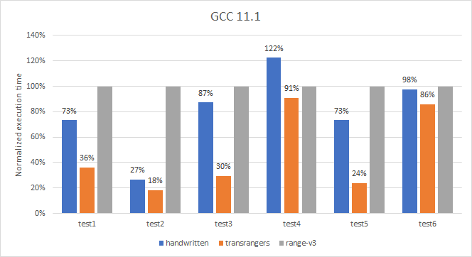
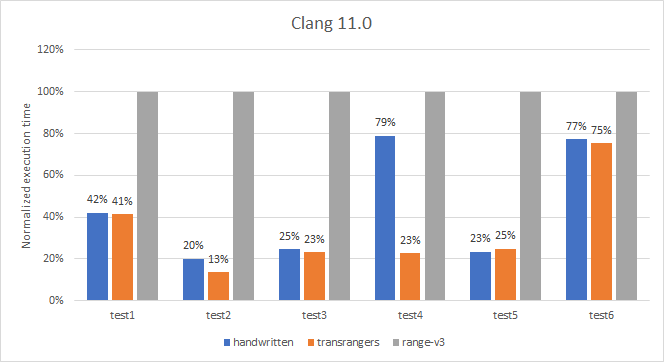
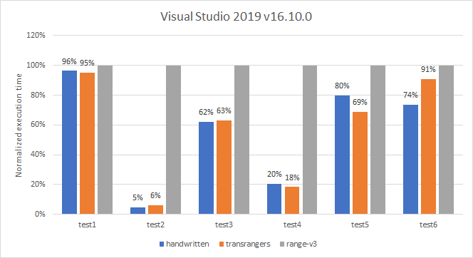

## Transrangers
An efficient, composable design pattern for range processing.
* [Intro](#intro)
* [Pull-based approach](#pull-based-approach)
* [Push-based approach](#push-based-approach)
* [Transrangers](#transrangers)
* [Performance](#performance)
* [Transrangers as a backend for view-based operations](#transrangers-as-a-backend-for-view-based-operations)
* [Conclusions](#conclusions)
* [Acknowledgments](#acknowledgments)
* [Annex A. Rangers are as expressive as range adaptors](#annex-a-rangers-are-as-expressive-as-range-adaptors)
### Intro
Consider the situation where we have a C++ (input or forward) range `rng`, *N* cascading range transformations *T<sub>i</sub>* and a final destination function object `dst` that successively consumes the values of the resulting range *T*<sub>*N*</sub>(···*T*<sub>1</sub>(`rng`)···).


We want to analyze the performance of various composable design patterns that can be applied to implement this scenario. 
### Pull-based approach
C++ ranges/[Range-v3](https://github.com/ericniebler/range-v3) introduces *range adaptors*, utilities that take a range and return a *view* (a cheaply copyable range-like object) externally behaving like a transformed range:
```cpp
using namespace std::views;
auto is_even = [](int x) { return x%2 == 0; };
auto x3 = [](int x) { return 3*x; };

for (int x: transform(x3, filter(is_even, rng))) {
  dst(x);
}
```
We call this design pattern *pull-based* because control (the loop in the example) is located between the transformed range and the point of consumption by `dst`: values are asked for (pulled) and then fed to `dst`.

Views are not particularly efficient in several situations:
* When the transformed range has fewer elements than the original (e.g. some elements are filtered out), there are more end-of-range checks than logically necessary. Take for instance `filter(is_even, rng)`: advancing to the next even element implies as many end-of-range checks as there are intervening odd elements plus one final check on the iterator to the even element, wich check is then redone at the outer loop. For exposition, the snippet above would expand to code equivalent to this:
```cpp
auto first = std::begin(rng);
auto last = std::end(rng);
while (first != last && !is_even(*first)) ++first; // first even element
while (first != last) { // main loop
  dst(x3(*first));
  while (++first != last && !is_even(*first)); // next even element
}
```
* Similarly, views over compositions of ranges ([`join`](https://en.cppreference.com/w/cpp/ranges/join_view), [`concat`](https://ericniebler.github.io/range-v3/structranges_1_1concat__view.html)) need to check for end-of-subrange at each iteration, in addition to the outer check. 

From a high-level perspective, a pull-based design implies that range termination will be checked both internally and at the point of value consumption. An alternative is to turn consumption into a callback, that is, to apply an inversion of control.
### Push-based approach
Push-based designs are used by a number of data-processing paradigms, such as *Reactive Programming* (a flavor of which is implemented in C++ by [RxCpp](https://github.com/ReactiveX/RxCpp)) and *transducers* (coming from Clojure and ported to C++ by, among others, the [zug](https://github.com/arximboldi/zug) library). For the purposes of our discussion, all these approaches are structurally equivalent to the following sample code:
```cpp
#define FWD(x) std::forward<decltype(x)>(x)

template<typename Pred, typename Out>
auto filter(Pred pred, Out dst)
{
  return [=](auto&& x) {
    return pred(x) ? true : dst(FWD(x));
  };
}

template<typename F, typename Out>
auto transform(F f, Out dst)
{
  return [=](auto&& x) {
    return dst(f(FWD(x)));
  };
}

auto out =
  filter(is_even,
    transform(x3,
      [&](int x) { dst(x); return true; }
    )
  );
    
for (auto&& x: rng) {
  if (!out(FWD(x))) break;
}
```
(Note that the transformation steps `filter(transform(dst))` are specified in reverse order than in the pull-based approach `transform(filter(rng))`.)

A *consumption function* (*subscriber* in RxCpp, *reduction function* in transducers parlance) accepts succesive range values and returns `false` when no more values are required (for early termination). Range transformation is then implemented as a chain of consumption functions stacked on top of one another (in RxCpp, transformations are attached to the data source rather than `dst`, but the resulting control flow is the same). The resulting code is more amenable to aggressive optimization than pull-based equivalents, and does not suffer from the double end-of-range check curse. Functions such as `filter` and `transform`, which take a consumption function and return an adapted consumption function, are precisely called *transducers*, and map logically to range adaptors in C++ ranges/Range-v3.

As it stands, this design is unfortunately not as expressive as the pull-based approach:
* Since consumption functions are passed element values rather than iterators, operations requiring access to past elements (e.g. [`unique`](https://ericniebler.github.io/range-v3/structranges_1_1views_1_1unique__fn.html)) can't be implemented for forward ranges/views whose iterators dereference to non-copyable rvalues.
* Operations requiring that extra elements be added to the tail of the transformed range can't be implemented because the consumption function is not informed about range termination (both RxCpp and transducers, however, make provision for this by augmenting the subscriber/transducer interface with termination signalling).
* More importantly, transformations involving more than one source range, for instance `concat(rng | filter(is_even), rng2) | transform(x3)`,

  

  can't be easily be implemented within a push-based scenario, as control flow would need to iterate first over `rng` and then jump to `rng2`, which is hard to specify declaratively. This is a fundamental trade-off when choosing between pull and push: pull lends itself to *fan-in* processing graphs (several sources) whereas push does to *fan-out* ones (several destinations):
  
  

We will show how to retain the efficiency of the push-based approach while remedying its drawbacks by evolving the design pattern to:
* using iterator passing rather than value passing,
* moving control flow into the intermediate processing steps.
### Transrangers
We introduce some definitions:
* A *cursor* is a lightweight [semiregular](https://en.cppreference.com/w/cpp/concepts/semiregular) object with a dereference operation. Pointers and iterators are cursors (no comparison or arithmetic will be done on them, though).
* A *consumption function* is a function/function object accepting a cursor and returning `true` (more range values will be accepted) or `false` (stop traversing the range).
* A *ranger* is a lightweight [copyable](https://en.cppreference.com/w/cpp/concepts/copyable) object that traverses an actual or implicit range and invokes a consumption function with cursors to the range elements. More specifically, if `Ranger` is a ranger type, `rgr` is of type `Ranger` and `dst` is a consumption function compatible with the cursors of `Ranger`:
  * `Ranger::cursor` is the type of the cursors emitted by `rgr`.
  * `rgr(dst)` succesively feeds the remaining range elements to `dst` until `dst` returns `false` or the range is fully traversed. The expression returns `false` if there *may* be remaining elements to process, in which case `rgr` can be further used with the same or a different consumption function.
* A *transranger* is a utility that takes a ranger and returns a new ranger over a transformed range.

Our original example would be ported to transrangers like this:
```cpp
using namespace transrangers;
    
// create the transforming ranger
// all() adapts rng to a ranger
auto rgr = transform(x3, filter(is_even, all(rng)));
    
// adapt dst to a ranger-compatible consumption function
// run the ranger against dst (p is a cursor)
rgr([&](auto p) { dst(*p); return true; });
```
The natural implementations of the adaptor `all` and transrangers `filter` and `transform` are:
```cpp
template<typename Range>
auto all(Range&& rng)
{
  using std::begin;
  using std::end;
  using cursor = decltype(begin(rng));
  
  return ranger<cursor>([first = begin(rng), last = end(rng)](auto dst) mutable {
    while (first != last) if (!dst(first++)) return false;
    return true;
  });
}
      
template<typename Pred, typename Ranger>
auto filter(Pred pred, Ranger rgr)
{
  using cursor = typename Ranger::cursor;
    
  return ranger<cursor>([=](auto dst) mutable {
    return rgr([&](auto p) {
      return pred(*p) ? dst(p) : true;
    });
  });
}

template<typename Cursor, typename F>
struct deref_fun
{
  decltype(auto) operator*() const { return (*pf)(*p); } 
    
  Cursor p;
  F*     pf;
};

template<typename F, typename Ranger>
auto transform(F f, Ranger rgr)
{
  using cursor = deref_fun<typename Ranger::cursor, F>;
    
  return ranger<cursor>([=](auto dst) mutable {
    return rgr([&](auto p) {
      return dst(cursor{p, &f});
    });
  });
}
```
(`ranger<cursor>(...)` is just some scaffolding to inject the required `cursor` nested typename into the returned ranger type. `deref_fun` is a wrapper over a cursor `p` dereferencing to `f(*p)`.)  

For this simple example, the generated code is basically the same (and as efficient) as in the push-based approach. Additionally, transrangers allow for operations that, as previously discussed, were not possible there:
```cpp
template<typename Ranger>
auto unique(Ranger rgr)
{
  using cursor = typename Ranger::cursor;
    
  return ranger<cursor>([=, start = true, p = cursor{}](auto dst) mutable {
    if (start) {               // need to get the first element
      start = false;
      bool cont = false;
      if (rgr([&](auto q) {
        p = q;                 // store the cursor
        cont = dst(q);         // keep the continue/stop indication from dst
        return false;          // stop ranging, we just wanted one element
      })) return true;         // empty range
      if (!cont) return false; // honor stop if dst told us so
    }
    return rgr([&](auto q) {   // regular loop once p has been initialized
      auto prev_p = p;
      p = q;
      return *prev_p == *q ? true : dst(q);
    });
  });
}
```
Not only can we keep a handle to the previous value thanks to cursor- (rather than value-) passing, but the fact that control flow resides into `unique` itself allows us to first call the wrapped ranger to get the first element and then process the remaining elements within a straightforward, potentially more optimizable loop: with the previous push-based approach, checking for the initialization of `p` would have to be done at each iteration. Also, internal control makes implementing fan-in operations trivial:
```cpp
auto concat()
{
  return [](auto&&) { return true; };
}

template<typename Ranger, typename... Rangers>
auto concat(Ranger rgr, Rangers... rgrs)
{
  // for brevity of exposition, it is assumed that all rangers have the
  // same cursor type
  using cursor = typename Ranger::cursor;
    
  return ranger<cursor>(
    [=, cont = false, next = concat(rgrs...)](auto dst) mutable {
      if (!cont) {
        if (!(cont = rgr(dst))) return false;
      }
      return next(dst);
    }
  );
}
```
### Performance
We have written a [benchmark suite](perf/perf.cpp) that exercises several range processing chains:
* Test 1: `filter|transform` over 1M integers.
* Test 2: `concat|take(1.5M)|filter|transform` over two vectors of 1M integers each.
* Test 3: `unique|filter` over 100k integers.
* Test 4: `join|unique|filter|transform` over a collection of 10 vectors of 100k integers each.
* Test 5: `transform(unique)|join|filter|transform` over a collection of 10 vectors of 100k integers each.

using three approaches:
* Handwritten code.
* A proof-of-concept, minimal [transrangers](include/transrangers.hpp) library.
* [Range-v3](https://github.com/ericniebler/range-v3).

on GCC 11.1, Clang 11.0 and Visual Studio 2019. The benchmark has been executed in a virtual environment by a dedicated [GitHub Action](https://github.com/joaquintides/transrangers/actions/workflows/benchmarks.yml), so results may have a fair degree of noise (if you volunteer to re-run the benchmark on a local machine please let me know). Execution times are shown normalized to those of Range-v3.







Some observations:
* In Clang, transrangers performance is generally equivalent to handwritten code and consistently outperforms Range-v3 by a large factor.
* Gains in GCC are more modest, and even there is a degradation (both in handwritten code and transrangers) for test 3 (`unique|filter`), which is shocking given that the handwritten code is extremely simple: some further inspection of the generated assembly is in order.
* in Visual Studio the only surprising situation is for transrangers in test 1 (`filter|transform`), with the added complication that the handwritten code performs excellently.
* In all compilers, Range-v3 performs very badly for test 2 (`concat|take|filter|transform`): this may be related to the fat iterator needed to traverse the multilayer range generated by `concat`.
### Transrangers as a backend for view-based operations
Transrangers have merit on its own as a composable and [expressive](#annex-a-rangers-are-as-expressive-as-range-adaptors) design pattern, but they can also be used internally by pull-based libraries such as C++ ranges/Range-v3 to accelerate their algorithms:
```cpp
template<ranges::input_range R, typename Proj=std::identity, typename Fun>
constexpr ranges::for_each_result<ranges::borrowed_iterator_t<R>, Fun>
for_each(R&& r, Fun f, Proj proj = {})
{
  if constexpr(has_ranger_v<R>) {
    ranger_for(r)([&](auto p) {
      std::invoke(f, std::invoke(proj, *p));
      return true;
    });
  }
  else {
    // classical code
  }
  return ranges::for_each_result{...};
}
```
In this design sketch, `has_ranger_v`/`ranger_for` are defined for non-view ranges (using `transrangers::all`) and then for as many views as desired (among those acting on input/forward ranges) in the case that the source range also have a ranger. If `has_ranger_v<R>` is false, the code defaults to the classical pull-based implementation. The user is not made aware of these internal optimizations. 
### Conclusions
Transrangers are a new design pattern for efficient, composable range processing that can be faster than pull-based C++/Range-v3 views whithout losing any expressiveness. The underlying architecture combines ideas from push processing with the internalization of control flow. Transrangers can be used on their own or be leveraged as an implementation detail of range libraries to improve the performance of view-based operations.
### Acknowledgments
Many thanks to [Sam Darwin](https://github.com/sdarwin) for developing the [GitHub Action](https://github.com/joaquintides/transrangers/actions/workflows/benchmarks.yml) used for benchmark automation.
### Annex A. Rangers are as expressive as range adaptors
**Proposition.** Any transformation performed by a range adaptor on input or forward ranges can be implemented as a transranger. Formally, given some (input or forward) ranges `rngs...` and a range adaptor `ra` acting on them, there is a transranger `tr` such that `tr(all(rngs)...)` produces the same values as `ra(rngs...)`.

**Proof.** Let us consider the case where there is just one source range `rng` (extension to many ranges is straightfoward). We construct an example of a transranger equivalent to `ra` as:
```cpp
auto tr = [=](auto rgr) { return all(ra(view(rgr))); };
```
When passed a source ranger, `tr` converts it into a Range-v3 view with `view(rgr)`, transforms this via `ra` and converts the result back into a ranger with `all` (a version of `all` is needed that stores a copy of its temporary argument to avoid dangling references). We are left then with the task or defining the `view` adaptor. Let us begin by assuming that `ra` works on input ranges and thus `view` need only model this: most of the implementation of `view` is boilerplate code save for some critical parts in its associated iterator:
```cpp
struct sentinel{};

template<typename Ranger>
class input_iterator
{
public:
  iterator_base(const Ranger& rgr) : rgr{rgr} { advance(); } 

  ...
  
  decltype(auto) operator*() const { return *p; }
  Iterator& operator++() { advance(); return *this; }
  ...

  friend bool operator==(const iterator_base& x, const sentinel&) { return x.end; }
  ...
  
private:
  ranges::semiregular_box<Ranger> rgr;
  bool                            end;
  typename Ranger::cursor         p;

  void advance()
  {
    end = rgr([&](auto q) { p=q; return false; }); 
  }
};
```
* `input_iterator` stores a copy of the associated ranger from the `view` parent container. Actually, this copy is wrapped into a [`semiregular_box`](https://en.cppreference.com/w/cpp/ranges/semiregular_wrapper) so that `input_iterator` is assignable even if `Ranger` is not. 
* Advancing the iterator reduces to doing a single-step call on the ranger (this is acheived by having the consumption function return `false`) and storing the newly produced cursor, or marking the end if there are no values left (`rgr` returns `true`).
* Dereferencing just uses the stored cursor.
* `input_iterator` knows when it has reached the end of the range (`end == true`), so we can use an empty `sentinel` type for iterator-sentinel equality comparison.

If `ra` requires that its argument be a forward range, we need to make the code slightly more complicated so that `forward_iterator` supports iterator-iterator equality comparison:
```cpp
template<typename Ranger>
class forward_iterator
{
public:
  ...

  friend bool operator==(const forward_iterator& x, const forward_iterator& y)
  {
    return x.n == y.n;
  }
  ...
  
private:
  ranges::semiregular_box<Ranger> rgr;
  bool                            end;
  typename Ranger::cursor         p;
  std::size_t                     n = 0;

  void advance()
  {
    end = rgr([&](auto q) { p = q; ++n; return false; }); 
  }
};
```
We simply store the number `n` of increments from the beginning and use that for equality comparison. This completes the proof. Note that the construct we have described is by no means an optimal implementation of a transranger for the underlying transformation: the proposition just asks for one possible realization of `tr`, not the best one. [`transranger_view.hpp`](include/transranger_view.hpp) provides a full implementation of the `view` adaptor. [`annex_a.cpp`](annex/annex_a.cpp) illustrates the construction of `tr` used in the proof.
